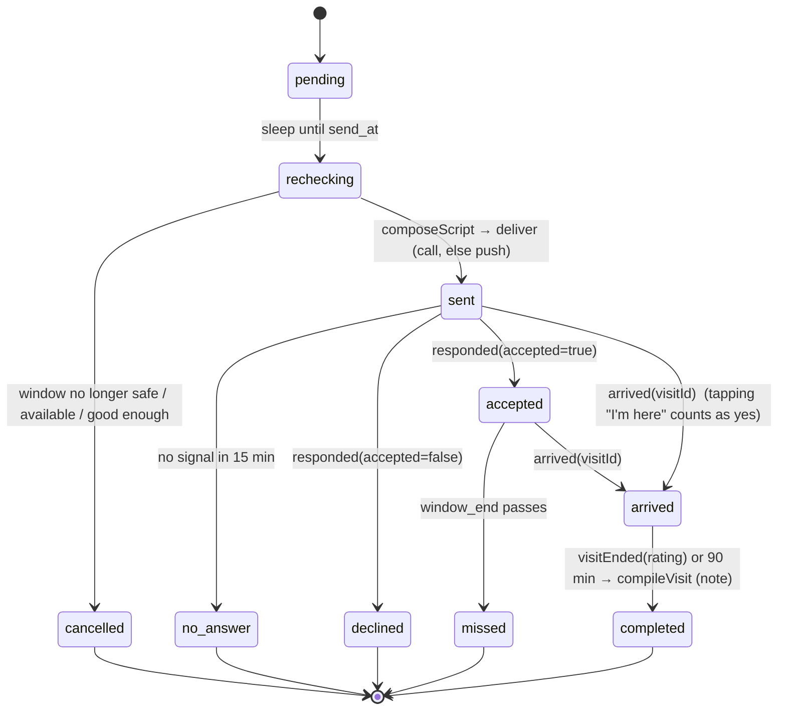
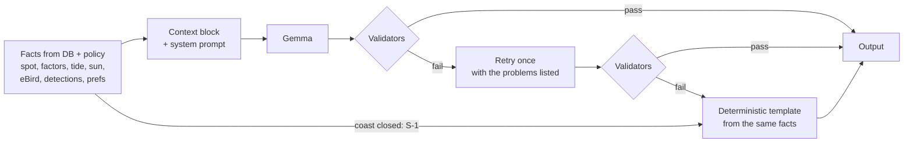

# Architecture

## Components and data flow

```mermaid
flowchart LR
  subgraph Open data
    OM[Open-Meteo<br/>weather · AQI · marine]
    EB[eBird API 2.0<br/>recent sightings]
  end

  GH[GitHub Actions cron<br/>hourly pull · keep-alive] -->|POST /cron/pull| API

  subgraph API["apps/api (Hono, one Node process)"]
    API[REST · /cron · /mcp]
    PULL[packages/data<br/>pullers + sun/tide features]
    POL[packages/policy<br/>score + safety S-1..S-5]
    AG[packages/agent<br/>context → LLM → validators]
    VOICE[/v1/voice/llm SSE<br/>+ post-call webhook/]
    W[Temporal worker<br/>in-process]
  end

  OM --> PULL
  EB --> PULL
  PULL --> DB[(Postgres + pgvector<br/>PGlite in dev)]
  TP[ml/tabpfn<br/>forecast_job.py, CPU] -->|p_rich| DB
  DB --> POL
  T[Temporal server] <--> W
  W -->|evaluateWindows| POL
  W -->|composeScript / compileVisit| AG
  AG --> G4[Gemma 4 31B<br/>AI Studio]
  VOICE --> AG
  AG --> G3[Gemma 3 1B<br/>Ollama]
  API --> EMB[nomic-embed-text<br/>Ollama] --> DB

  W -->|deliver| CALL[ElevenLabs + Twilio<br/>outbound call]
  W -->|fallback| PUSH[Web Push / VAPID]
  CALL -->|custom LLM turns| VOICE
  CALL -->|signed webhook| VOICE
  CALL --> PHONE((Your phone))
  PUSH --> PHONE

  subgraph WEB["apps/web (Next.js PWA)"]
    UI[spots · invitations · notes · /call]
    VISIT[/visit pocket mode/]
    BN[BirdNET TF.js<br/>Web Worker, on-device]
  end
  PHONE --> UI
  VISIT -->|mic, 3-s windows| BN
  BN -->|JSON detections only<br/>IndexedDB outbox| API
  UI <--> API
  API -->|signals: responded / arrived / visitEnded| W
  W -.->|spans| S[Sentry]
```

- **Audio stays on the phone.** Only JSON detections cross the network.
- **The Temporal worker runs inside the API process.** It starts on boot and runs with `temporal: off` if the server can't be reached. `pnpm worker` runs it standalone.
- **One LLM client** (`packages/llm`) is configured purely by env: `LLM_*` for scripts/notes, `CHAT_LLM_BASE_URL` for voice, `EMBED_*` for embeddings.

## Workflows

`UserDayWorkflow(userId)` has id `day-<userId>` and runs one per user. At IST hh:05 each hour, it runs `evaluateWindows`. If there's a pick, it creates the invitation and starts a child `InvitationWorkflow` with id `inv-<userId>-<window_start>` and `REJECT_DUPLICATE`, so a restart can't start a second call. At IST midnight it runs `reflect` (threshold nudge, per-hour accept factors) and then `continueAsNew`.

### InvitationWorkflow



- Signals: `responded({accepted})`, `arrived({visitId})`, `visitEnded({rating})`. Query: `status`.
- Activities retry 3× with exponential backoff (5 s × 2). `ValidationError` is non-retryable. Timeouts are 1 min for DB/policy/delivery and 10 min for the LLM activities (Gemma 4 on AI Studio takes 60–110 s).
- `deliver` is idempotent. It never re-delivers an invitation that is already past `pending`.
- Memory updates happen outside the visit path: preferences are written live from the voice intent (with the quoted utterance), and `reflect` runs nightly.

## The decision

This is plain code in `packages/policy` (pure functions; `now` is passed in). Every weight lives in `src/config.ts`. For each spot × each of the next 6 one-hour windows:

```
score = p_rich · comfort · tide_fit · light_bonus · novelty · availability
```

| Factor | Range | Rule |
| --- | --- | --- |
| `p_rich` | 0–1 | Latest TabPFN forecast. With no forecast, the prior is 0.5 (`model_version = "prior"`). |
| `comfort` | 0–1 | Apparent temp: 1.0 at ≤ 30 °C, falling linearly to 0 at 38 °C. Multiplied by AQI: 1.0 at ≤ 100, 0.5 at 150, 0 at ≥ 200. 0 if precipitation > 2 mm/h. |
| `tide_fit` | 0–1 | Coastal spots only (1.0 for others). 1.0 when falling and 1–3 h before low; 0.6 within 1 h of low; 0.2 when rising or > 3 h out; 0 within 60 min of high or with no tide data. |
| `light_bonus` | 1–1.3 | `1 + 0.3 ×` the share of the window that falls in golden hour |
| `novelty` | 1–1.3 | A loved species reported nearby in 48 h: `1 + 0.15n`, capped at 1.3 |
| `availability` | 0 or 0.5–1.5 | 0 inside quiet hours (checked over `[send_at, window_end]`), at 2 invites today, within 3 h of a decline, or while an invitation is open. Otherwise it's the learned per-hour accept factor. |

- **Invite** when `score ≥ user.threshold` (default 0.35; `reflect` nudges it ±0.05 nightly) and S-1..S-5 all pass.
- **`send_at`** = `window_start − travel_min − 10 min`.
- **`recheckWindow`** re-runs the policy at send time, so the invitation is cancelled if conditions turned.
- Safety fails closed: a coastal spot with missing sun times triggers S-1, and one with no high-tide data triggers S-2.

## The context-first agent

Tool calling is uneven across Gemma providers. So the agent never asks the model to fetch anything: the code builds a facts block first, and the model only writes prose.



Validators (`packages/agent/src/validate.ts`):

| Validator | Rejects |
| --- | --- |
| `numbersInFacts` | any number not present in the facts |
| `speciesInFacts` | a species not in detections or eBird for that spot |
| `unsafeAdvice` | mudflats, wading, swimming, leaving the path, crossing the creek (clause-scoped negation) |
| `coastalClosedProblems` | encouragement to go to the coast after dark, or text missing "too late / head back" |
| `pastLowTide` | selling a low tide that has already passed |
| `confidenceBands` | a detected bird named without the right band: ≥ 0.8 confident, 0.6–0.8 fairly confident, < 0.6 possibly |
| `hasSafetyLine` | a coastal script without "Stay on firm ground" (S-3) |
| `quoteIsSubstring` | a preference whose `quote` isn't the user's exact words |
| `verifyNote` | a field note with any species, count or time not in the visit facts |

If the model call itself errors (timeout, HTTP 5xx), the agent goes straight to the template without a retry, so a live call never waits twice. For a closed coast (S-1), `composeScript` skips the model entirely and uses the template. Every run is logged to `agent_runs` with the model, or `template` if the fallback was used, plus tokens and latency.
